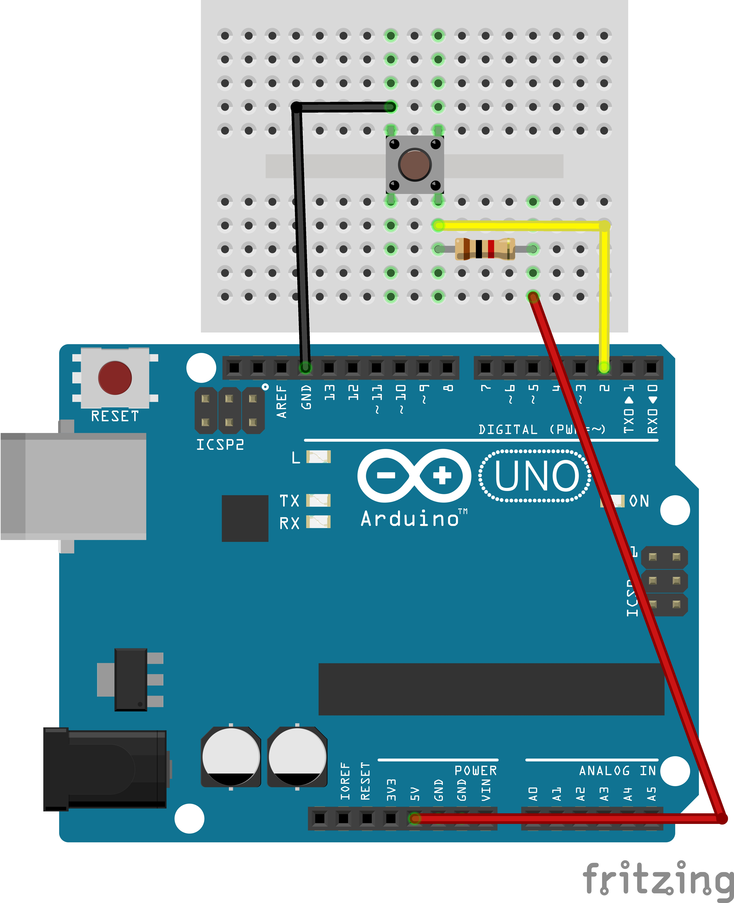

# 🔧 کار با وقفه ها در آردوینو

## 🧰 <mark>لیست قطعات</mark>

-  برد بورد
-  سیم جامپر نری به نری قرمز
-  سیم جامپر نری به نری مشکی
- سیم جامپر نری به نری زرد
- PushButton
-  مقاومت 1k اهم
-  Arduino Uno
-  کابل USB Type A-B (پرینتر)

## 🖼️ تصویر پروژه

---
> ⚠️ هشدار
>
>  تاکید می شود کودکان با نظارت والدین پروژه را انجام دهند.

---

همیشه با شور و شوق زندگی کنید!

مهدی احمدی
